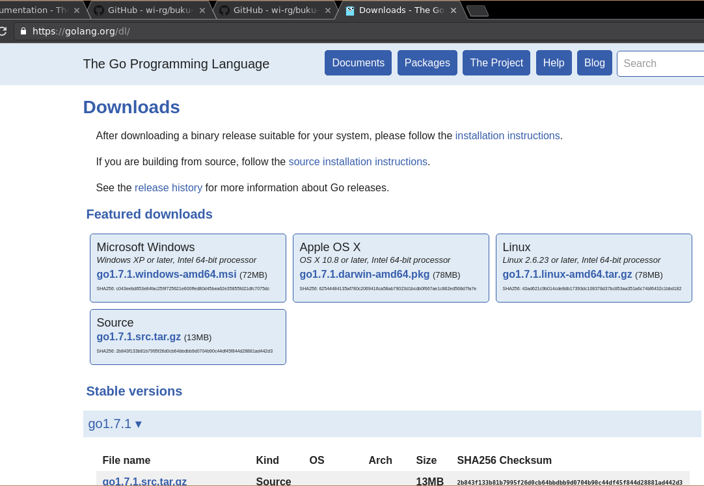
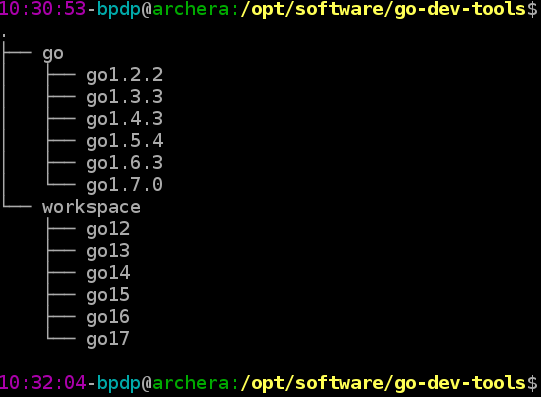
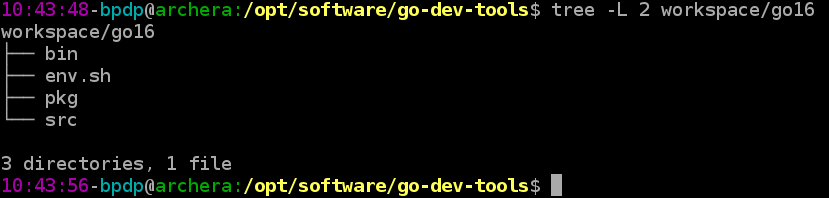
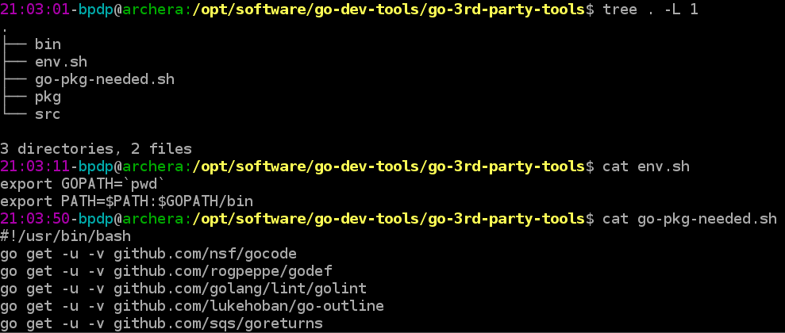
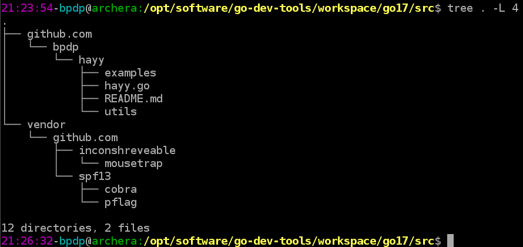

# Pengenalan Go

## Apa itu Go?

Go adalah nama bahasa pemrograman sekaligus nama implementasi dalam bentuk kompilator (`compiler`). Untuk pembahasan berikutnya, istilah `Go` akan mengacu juga pada spesifikasi bahasa pemrograman serta peranti pengembangannya.

## Lisensi Go

Go didistribusikan dengan menggunakan lisensi modifikasi dari BSD. Lisensi lengkap dari Go bisa diakses di [URL Lisensi Go](http://golang.org/LICENSE). Secara umum, penggunaaan lisensi ini mempunyai implikasi sebagai berikut:
* boleh digunakan untuk keperluan komersial maupun non-komersial tanpa batasan
* boleh memodifikasi sesuai keperluan
* boleh mendistribusikan
* boleh memberikan sublisensi ke pihak lain
* boleh memberikan garansi
* tidak boleh menggunakan merk dagang Go
* tanpa jaminan dan jika terjadi kerusakan terkait penggunaan software ini maka pemberi lisensi tidak bisa dituntut
* jika mendistribusikan harus mengikutsertakan pemberitahuan hak cipta.

## Instalasi Go

### Distribusi Go

Go tersedia pada berbagai platform. Proyek Go sendiri secara resmi mendukung platform Linux, FreeBSD, MacOSX, dan Windows. Dukungan tersebut merupakan dukungan resmi dan distribusi `binary executable` dari berbagai platform tersebut tersedia di [repository downloads Go](http://golang.org/dl/) seperti bisa dilihat di gambar berikut:

Dengan dukungan tersebut, Proyek Go akan menerima laporan `bugs` terkait dengan distribusi pada berbagai platform tersebut. Meski demikian, bukan berarti platform-platform lain tidak bisa menggunakan Go karena distribusi dalam bentuk kode sumber tersedia dan telah berhasil dikompilasi ke berbagai platform: NetBSD, OpenBSD, DragonFlyBSD, dan lain-lain. Informasi mengenai platform-platform yang mungkin bisa digunakan oleh Go bisa diperoleh di [Wiki](https://github.com/golang/go/wiki#platform-specific-information).

### Download dan Install Go

Download dan instalasi Go pada tulisan ini adalah download dan instalasi untuk lebih dari satu versi Go dan masing-masing menggunakan workspace sendiri-sendiri. Hal ini disebabkan karena seringkali software yang dibangun ditargetkan untuk lebih dari satu versi, misalnya Go 1.5 ke atas (Go 1.5.x, 1.6.x, dan 1.7.x). Kondisi ini menjadi tidak sederhana karena penulis tidak ingin mencampuraduk source code yang dibuat menggunakan masing-masing versi. Go sendiri menyarankan untuk menggunakan satu workspace untuk semua proyek Go yang kita buat. Satu workspace saja tidak masalah jika hanya mentargetkan satu versi. Di bagian ini penulis akan menjelaskan konfigurasi yang saya gunakan untuk menangani masalah tersebut.

~~~
Catatan:

Go akan diinstall di direktori /opt/software/go-dev-tools/go/goVERSI

VERSI = versi dari Go yang akan diinstall, misalnya go1.7.3
Lokasi instalasi tersebut saya gunakan karena saya mempunyai lebih dari 1 versi Go, jika nanti ada versi lainnya, versi lain tersebut akan saya install (misal versi 1.6.3) di /opt/software/go-dev-tools/go/go1.6.3
~~~

Meski mendukung banyak platform, di buku ini hanya akan dibahas penggunaan Go di platform Linux. Pada dasarnya peranti pengembang yang disediakan sama. Silahkan menyesuaikan dengan platform yang anda gunakan. Untuk instalasi berikut ini, ambil distribusi yang sesuai dengan platform di komputer anda. Untuk pembahasan ini, digunakan `go1.7.3.linux-amd64.tar.gz`. Setelah itu, ikuti langkah-langkah berikut:

~~~bash
$ ls -la
total 80632
drwxr-xr-x 1 bpdp users       52 Oct 20 21:38 .
drwxr-xr-x 1 bpdp users      198 Jun 13 13:17 ..
-rw-r--r-- 1 bpdp users 82565628 Oct 20 02:02 go1.7.3.linux-amd64.tar.gz
$ mkdir -p /opt/software/go-dev-tools/go
$ cd /opt/software/go-dev-tools/go
$ tar -xvf ~/master/go/1.7/go1.7.3.linux-amd64.tar.gz
$ mv go go1.7.3
~~~

Setelah menjalankan langkah-langkah di atas, Go sudah terinstall di direktori `/opt/software/go-dev-tools/go/go1.7.3`

### Konfigurasi Variabel Lingkungan Sistem Operasi, Compiler Go, dan Workspace

Untuk konfigurasi kompiler, ada tiga langkah yang perlu dilakukan: download, ekstrak pada lokasi tertentu, dan terakhir setting environment variables. Pada konfigurasi ini, compiler dan workspace berada pada /opt/software/go-dev-tools/. Lokasi ini selanjutnya akan kita sebut dengan GODEVTOOLS_HOME. Setelah download dan install compiler Go seperti langkah di atas, buat struktur direktori sebagai berikut (untuk go1.7.3 sudah dibuat dengan cara di atas):

Direktori go digunakan untuk lokasi semua versi compiler Go. Direktori workspace digunakan untuk menyimpan source code yang kita buat seesuai dengan versi Go yang kita targetkan. Untuk setiap direktori di workspace, buat struktur dan 1 file env.sh sebagai berikut:

Isi dari file env.sh adalah sebagai berikut:

~~~bash
export GOPATH=`pwd`
export PATH=$PATH:$GOPATH/bin
~~~

Go menggunakan beberapa variabel lingkungan sistem operasi. Supaya berfungsi dengan baik, tetapkan nilai-nilai variabel lingkungan tersebut di file inisialisasi shell (penulis menggunakan Bash, sehingga file-file inisialisasi diletakkan di `$HOME/.bashrc`). Meski bisa diletakkan pada file tersebut, penulis menyarankan untuk meletakkan pada suatu file text biasa dan kemudian di - *source*. Pada bagian ini, penulis akan meletakkan di file `%HOME/env/go/go1.7.3`.

~~~bash
GODEVTOOLS_HOME=/opt/software/go-dev-tools

GO_HOME=$GODEVTOOLS_HOME/go/go1.7.3
LITEIDE_HOME=$GODEVTOOLS_HOME/liteide
GOTOOLS=$GODEVTOOLS_HOME/workspace/go17/bin
GO3RDPARTYTOOLS=$GODEVTOOLS_HOME/go-3rd-party-tools

export GOROOT=$GO_HOME
export GOOS=linux
export GOARCH=amd64
export GOHOSTOS=linux
export GOHOSTARCH=amd64

# https://golang.org/cmd/go/#hdr-GOPATH_environment_variable
# a)    If you don't set your GOBIN env variable, 
#       you get the Go compiler binaries going in 
#       GOROOT/bin whereas the your binaries are going 
#       in GOPATH/bin. (I personally like this separation of 
#       binaries.)
# (b)   If you set your GOBIN to anything, then both the Go 
#       binaries and your binaries are going to GOBIN.
#export GOBIN=$GOROOT/bin

export PATH=$PATH:$GO_HOME/bin:$LITEIDE_HOME/bin:$GOTOOLS:$GO3RDPARTYTOOLS/bin

alias godev='cd $GODEVTOOLS_HOME/workspace/go17'
~~~

Dengan memasukkan beberapa variabel lingkungan tersebut ke file, saat kita ingin menggunakan Go, tinggal di - *source* sebagai berikut:

~~~bash
$ source ~/env/go/go1.7.3
~~~

Setelah itu, Go bisa digunakan. Untuk melihat hasil, eksekusi perintah `go env`, hasilnya seharusnya adalah sebagai berikut:

~~~bash
$ go env
GOARCH="amd64"
GOBIN=""
GOEXE=""
GOHOSTARCH="amd64"
GOHOSTOS="linux"
GOOS="linux"
GOPATH=""
GORACE=""
GOROOT="/opt/software/go-dev-tools/go/go1.7.3"
GOTOOLDIR="/opt/software/go-dev-tools/go/go1.7.3/pkg/tool/linux_amd64"
CC="gcc"
GOGCCFLAGS="-fPIC -m64 -pthread -fmessage-length=0 -fdebug-prefix-map=/tmp/go-build947764430=/tmp/go-build -gno-record-gcc-switches"
CXX="g++"
CGO_ENABLED="1"
$
~~~

Ssaat bekerja menggunakan Go, pada dasarnya kita akan menemukan berbagai macam proyek yang bisa dikategorikan menjadi 2 berdasarkan output dari proyek tersebut: (1) ready-to-use application — aplikasi yang siap dipakai, biasanya didistribusikan dalam bentuk binary executable(s) atau kode sumber seperti nsq, Hugo, dan lain-lain. (2) pustaka / library. Untuk dua kategori ini, ada dua perlakuan.

**Ready-to-use application**

Untuk kategori ini, siapkan lokasi khusus di media penyimpan untuk menyimpan hasil binary executable, setelah itu set PATH, GOPATH dan go get -u -v repo. Berikut adalah setting pada komputer penulis:

Isi dari file `go-pkg-needed.sh` adalah sebagai berikut, anda bisa menambah atau mengurangi sesuai kebutuhan:

~~~bash
#!/usr/bin/bash
go get -u -v github.com/nsf/gocode
go get -u -v github.com/rogpeppe/godef
go get -u -v github.com/golang/lint/golint
go get -u -v github.com/lukehoban/go-outline
go get -u -v github.com/sqs/goreturns
go get -u -v golang.org/x/tools/cmd/gorename
go get -u -v github.com/tpng/gopkgs
go get -u -v github.com/newhook/go-symbols
go get -u -v golang.org/x/tools/cmd/guru
go get -u -v github.com/derekparker/delve/cmd/dlv
go get -u -v github.com/pointlander/peg
go get -u -v github.com/songgao/colorgo
go get -u -v github.com/constabulary/gb/...
# glide now taken from release page 
go get -u -v github.com/Masterminds/glide
go get -u -v github.com/motemen/gore
go get -u -v github.com/onsi/ginkgo/ginkgo
go get -u -v github.com/onsi/gomega
go get -u -v github.com/smartystreets/goconvey
go get -u -v github.com/blynn/nex
go get -u -v golang.org/x/tools/cmd/goimports
go get -u -v golang.org/x/tools/cmd/gotype
go get -u -v github.com/zmb3/gogetdoc
go get -u -v github.com/govend/govend
~~~

Dengan konfigurasi seperti itu, kerjakan berikut ini untuk install:

~~~bash
$ source env/go/go1.7.3
$ cd /opt/software/go-dev-tools/go-3rd-party-tools
$ source env.sh
$ ./go-pkg-needed.sh
~~~
Setelah proses sebentar, hasil binary executables akan diletakkan pada $GO3RDPARTYTOOLS/bin dan bisa kita jalankan langsung.

**Catatan**: jangan meletakkan paket-paket executables ini dalam skema vendoring karena bisa mencampuradukkan dan mengacaukan letak dari hasil kompilasi.

**Pustaka / Library**

Untuk pustaka, sebaiknya menggunakan vendoring (aktif default mulai Go 1.6+). Pustaka ini biasanya kita gunakan pada proyek kita. Untuk kasus seperti ini, gunakan vendoring. Dengan struktur workspace seperti yang telah dijelaskan di atas, gunakan tools yang mendukung vendoring (penulis menggunakan govend). Direktori vendor diletakkan pada src/ dan pustaka di src/vendor dikelola menggunakan govend. Berikut ini contoh struktur direktori yang penulis gunakan:

Pada skema di atas, proyek saya adalah hayy dan bisa di akses menggunakan skema import github.com/bpdp/hayy. Proyek saya tersebut menggunakan pustaka github.com/spf13/cobra (github.com/inconshreveable/mousetrap dan github.com/spf13/pflag adalah dependency dari github.com/spf13/cobra). Dengan demikian, vendoring ini memungkinkan kita mengelola dependency dengan lebih baik dan membuat source code proyek kita “bersih” dari berbagai pustaka dependencies.

### Menguji Instalasi Go

Kode sumber Go yang kita buat bisa dijalankan / dieksekusi tanpa harus dikompilasi (jadi seperti script Python atau Ruby) atau bisa juga dikompilasi lebih dulu untuk menghasilkan `binary executable`. Selain menghasilkan `binary executable`, sebenarnya ada paket pustaka yang dimaksudkan untuk digunakan dalam program (disebut sebagai `package`). Package akan dibahas lebih lanjut pada bab-bab berikutnya.

Untuk menguji, buat program sederhana seperti listing `hello.go`. Setelah itu, gunakan `go run namafile.go` untuk menjalankan secara langsung atau dikompilasi lebih dulu dengan `go build namafile.go`.

~~~go
// hello.go
package main

import "fmt"

func main() {
	fmt.Printf("hello, world\n")
}
~~~
	
Berikut ini adalah langkah-langkah untuk mengeksekusi `hello.go`:

~~~bash
$ go run hello.go 
hello, world
$ go build hello.go
$ ls -la
total 1624
drwxr-xr-x 1 bpdp users     102 Sep 12 21:20 .
drwxr-xr-x 1 bpdp users     288 Aug 15 11:24 ..
-rwxr-xr-x 1 bpdp users 1650350 Sep 12 21:20 hello
-rw-r--r-- 1 bpdp users     162 Aug 15 11:28 hello-formatted.go
-rw-r--r-- 1 bpdp users      86 Aug 15 11:26 hello.go
-rw-r--r-- 1 bpdp users     170 Aug 15 11:28 hello-unformatted.go
$ ./hello 
hello, world
$ file hello
hello: ELF 64-bit LSB executable, x86-64, version 1 (SYSV), statically linked, not stripped
$
~~~

## Memahami Lingkungan Peranti Pengembangan Go

Saat menginstall Go, kita akan memperoleh 3 buah file `binary executable`:

~~~bash
$ ls /opt/software/go-dev-tools/go/go1.7.3/bin/
total 27496
drwxr-xr-x 1 bpdp users       24 Sep  8 02:38 .
drwxr-xr-x 1 bpdp users      230 Sep  8 02:38 ..
-rwxr-xr-x 1 bpdp users  9954032 Sep  8 02:35 go
-rwxr-xr-x 1 bpdp users 15156929 Sep  8 02:37 godoc
-rwxr-xr-x 1 bpdp users  3036195 Sep  8 02:35 gofmt
$
~~~

Penjelasan untuk masing-masing akan diuraikan di sub-sub bab berikut.

### go

`go` merupakan peranti untuk mengelola kode sumber Go yang kita buat. Beberapa argumen dari `go` adalah:

~~~bash
$ go
Go is a tool for managing Go source code.

Usage:

	go command [arguments]

The commands are:

	build       compile packages and dependencies
	clean       remove object files
	doc         show documentation for package or symbol
	env         print Go environment information
	fix         run go tool fix on packages
	fmt         run gofmt on package sources
	generate    generate Go files by processing source
	get         download and install packages and dependencies
	install     compile and install packages and dependencies
	list        list packages
	run         compile and run Go program
	test        test packages
	tool        run specified go tool
	version     print Go version
	vet         run go tool vet on packages

Use "go help [command]" for more information about a command.

Additional help topics:

	c           calling between Go and C
	buildmode   description of build modes
	filetype    file types
	gopath      GOPATH environment variable
	environment environment variables
	importpath  import path syntax
	packages    description of package lists
	testflag    description of testing flags
	testfunc    description of testing functions

Use "go help [topic]" for more information about that topic.
~~~

### godoc

`godoc` merupakan peranti untuk menampilkan dokumentasi paket pustaka standar Go atau menampilkan server untuk dokumentasi Go (mirip seperti yang terdapat pada [website dokumentasi Go](http://golang.org/doc/).

~~~bash
$ godoc 
usage: godoc package [name ...]
	godoc -http=:6060
  -analysis string
    	comma-separated list of analyses to perform (supported: type, pointer). See http://golang.org/lib/godoc/analysis/help.html
  -ex
    	show examples in command line mode
  -goroot string
    	Go root directory (default "/opt/software/go-dev-tools/go/go1.7.3")
  -html
    	print HTML in command-line mode
  -http string
    	HTTP service address (e.g., ':6060')
  -httptest.serve string
    	if non-empty, httptest.NewServer serves on this address and blocks
  -index
    	enable search index
  -index_files string
    	glob pattern specifying index files; if not empty, the index is read from these files in sorted order
  -index_interval duration
    	interval of indexing; 0 for default (5m), negative to only index once at startup
  -index_throttle float
    	index throttle value; 0.0 = no time allocated, 1.0 = full throttle (default 0.75)
  -links
    	link identifiers to their declarations (default true)
  -maxresults int
    	maximum number of full text search results shown (default 10000)
  -notes string
    	regular expression matching note markers to show (default "BUG")
  -play
    	enable playground in web interface
  -q	arguments are considered search queries
  -server string
    	webserver address for command line searches
  -src
    	print (exported) source in command-line mode
  -tabwidth int
    	tab width (default 4)
  -templates string
    	directory containing alternate template files
  -timestamps
    	show timestamps with directory listings
  -url string
    	print HTML for named URL
  -v	verbose mode
  -write_index
    	write index to a file; the file name must be specified with -index_files
  -zip string
    	zip file providing the file system to serve; disabled if empty
~~~

### gofmt

`gofmt` merupakan peranti untuk mem-format kode sumber dalam bahasa pemrograman Go.

~~~bash
$ gofmt --help
usage: gofmt [flags] [path ...]
  -cpuprofile string
    	write cpu profile to this file
  -d	display diffs instead of rewriting files
  -e	report all errors (not just the first 10 on different lines)
  -l	list files whose formatting differs from gofmt's
  -r string
    	rewrite rule (e.g., 'a[b:len(a)] -> a[b:]')
  -s	simplify code
  -w	write result to (source) file instead of stdout
~~~

Untuk melihat bagaimana `gofmt` bisa digunakan untuk membantu memformat kode sumber, buat kode sumber sederhana berikut ini:

~~~go
// hello-unformatted.go
package main
import "fmt"
func main() {
	fmt.Printf("halo\n") // menampilkan tulisan
	   fmt.Printf("dunia")	// ini tulisan baris kedua
}
~~~

Format file kode sumber di atas sebagai berikut:

~~~bash
$ gofmt hello-unformatted.go > hello-formatted.go
~~~

Hasilnya adalah sebagai berikut:

~~~go
// hello-formatted.go 
package main

import "fmt"

func main() {
		fmt.Printf("halo\n") // menampilkan tulisan
		fmt.Printf("dunia")  // ini tulisan baris kedua
}
~~~

