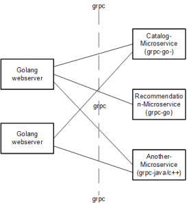
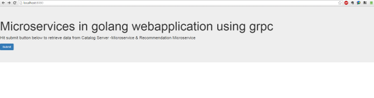

# Go dan Microservices
golang dan microservice memiliki konsep yang mirip yaitu servis yang kecil, yang difokuskan
untuk satu fungnsionalitas tertentu dan berkomunikasi melalui HTTP, TPC atau Message Queue
    Ketika mempublish API untuk konsumsi umum HTTP dan JSON sudah menjadi standar
tetapi ada juga alternatif lain untuk komunikasi inter-servis dengan menggunakan library
protobuf
            (Protokol buffer adalah cara untuk meng encoding struktur data dengan cara yang efisien
            dan juga degan format yang dapat di extend atau diperluas/diperbesar
            google menggunakan protocol buffers untuk hampir semua protokol internal RPC)

berikut ini adalah contoh golang micro-services yang menerima koneksi HTTP/JSON pada level API
dan kemudian memanfaatkan gRPC untuk komunikasi inter-servis.


gambar diatas adalah API endpoint menerima request http pada micro.demo:8080 dan kemudian menghasilkan beberapa 
RPC request kepada backend servis.
    NB: Data pada setiap servis disimpan dalam format JSON dan file biasa dimasukan pada direktori /data/
        pada kenyataannya setiap servis dapat memilih datastore nya sendiri - sendiri. Sebagai contoh
        Geo servis dapat menggunakan PostGis atau database lain untuk digunakan pada geospacial queries.

## Memahami Microservices
microservice adalah istilah untuk salah satu jenis arsitektur software atau aplikasi
yang bersifat micro(sangat kecil) yang difokuskan untuk satu fungsionalitas tertentu,
dan tidak sekedar dengan memisahkan berdasarkan user-role atau subdomain saja, tetapi 
aplikasi akan di breakdown lebih rinci lagi dari sisi fungsionalitasnya. Aplikasi 
akan dirancang agar setiap fungsi bekerja secara independen, dan setiap fungsi dapat 
menggunakan teknologi stack yang sesuai dengan kebutuhan, yang artinya akan terdapat
teknologi yang berbeda - beda dalam satu aplikasi besar.

Dengan pemisahan aplikasi berdasarkan fungsinya ini, pada akhirnya akan menemui keragaman
teknologi dalam sebuah satu layanan, misalkan dari layanan blog yang dapat dipecah menjadi 
beberapa fungsi utama misalnya : fungsi konten, user management, komentar, rangking, search
dan lainnya.
Pada bagian fungsi konten mungkin kita dapat menggunakan PHP dan mysql, tetapi pada komentar
kita menggunakan python dan mongodb, sedangkan di search menggunakan nodejs dan elasticsearch untuk 
menyimpan datanya. Disini terlihat bahwa setiap fungsi / permasalahan teknis dapat diselesaikan 
dengan cara dan teknologi yang berbeda - beda.  
Dalam konsep microservice, kita tidak hanya melakukan pemisahan di level aplikasi saja, tetapi
dari sisi infrastruktur juga, kita akan menemukan keragaman arsitektur, konfigurasi dan optimalisasi
sistem yang berbeda, dan sering juga ditemukan jumlah dan spesifikasi server yang tidak sama antara
service yang satu dengan yang lain.


Sumber : 	google.com 
			https://github.com/harlow/go-micro-services
			https://id.techinasia.com/talk/migrasi-microservice-tidak-optimal
			
## Arsitektur Microservices


## Go dan Microservices

Bagaimana serta peranti apa saja yang diperlukan untuk mengimplementasikan microservices di Go


## Microservices di Go Menggunakan GoKit
<b>Gokit</b> adalah salah satu tool programing terdistribusi untuk membangun microservices, 
    yang berguna untuk menyelesaikan permasalahan yang biasanya muncul ketika membangun 
    sistem terdistribusi, sehingga programer dapat lebih fokus pada proses bisnis.
    
sedikit sejarah mengenai <b>microservices</b>  secara tradisional, aplikasi web dibangun menggunakan 
    pendekatan monolithic dimana seluruh aplikasi dibuat, didesain, dideploy dan di maintain secara keseluruhan
        contohnya adalah aplikasi wordpress. Wordpress merupakan contoh paling mudah untuk menggambarkan arsitektur 
        aplikasi yang bersifat monolitik, dimana dalam satu aplikasi kita dapat memiliki frontend sekaligus backend.
        semua Fitur security, performance, manajemen, konten, ad, statistik, semuanya dibangun dengan menggunakan
        PHP dan database MYSQL dalam source code yang sama.
pada contoh aplikasi web diatas mau tidak mau akan timbul banyak masalah umum dari waktu ke waktu, misalnya
cukup mudah untuk layer abstak yang bocor antar modul, kemudian bagian aplikasi yang mungkin memerlukan 
power yang berbeda satu sama lain yang memaksa developer untuk men scale, membanung dan mendeploy ulang seluruh aplikasi
Aplikasi berbasis microservices bertujuan untuk mengatasi masalah diatas.
Ketika aplikasi monolitik memiliki satu source logs, satu source metrik, satu aplikasi untuk di deploy 
dan satu API untuk di rate limit,sedangkan microservis memiliki beberapa sources, bebrapa hal yang menjadi
fokus utama microservis antara lain :
 1. rate limiters yaitu memberi limit pada batas threshold atas
 2. Serialization adalah konversi antara bahasa struktur data ke byte stream untuk mempresentasikan ke sistem yang lain.
	sistem yang lain tersebut biasanya berupa browser(json/xml/html) atau database
 3. Logging adalah sebuah catatan output dari aplikasi yang terstruktur yang diurutkan berdasarkan waktu
 4. Metrics adalah catatan yang di instrumenkan dari bagian aplikasi yang termasuk jarak latency, perhitungan request, sistem health dan lain lain. 
 5. Circuit Breakers untuk mencegah resilency terhadap kerusakan intermittent
 6. Request Tracing untuk mendiagnosa masalah antar servis dan membuat ulang sistem secara keseluruhan
 7. Services Discovery memungkinkan servis yang berbeda - beda untuk menemukan satu sama lain

go-kit adalah salah satu tools untuk menangani permasalahan diatas, terdiri dari beberapa abstraksi dan di encode 
menjadi paket - paket yang menyediakan seperangkat interfaces yang dibutuhkan developer.


<b>Berikut adalah contoh program untuk menghitung total integer yang dimasukan 
dan akan direspon dengan total nya menggunakan go-kit</b> 
    
    Pertama kita membuat interface yang akan digunakan.
```javascript    
    type Counter interface {
	Add(int) int
	}	
```
dengan implementasi sebagai berikut : 
```javascript    
	type countService struct {
		v  int
		mu sync.Mutex
	}
	func (c *countService) Add(v int) int {
		c.mu.Lock()
		defer c.mu.Unlock()
		c.v += v
		return c.v
	}
```	
kemudian endpoint pada go-kit merepresentasikan satu RPC dan menjadi dasar untuk pembuatan klien - server,
berikut contoh implementasi endpoint pada go-kit  :
```javascript    	
	type Endpoint func(ctx context.Context, request interface{}) (response interface{}, err error)
```
kemudian adapter pada go-kit memungkinkan struct yang diimplementasikan kepada satu interfaces 
yang digunakan ketika membutuhkan interface lainnya, jadi pada kasus ini adapter akan digunakan sebagai endpoint
untuk menghandle request dan respon akan menggunakan fungsi bernama encoder/encoder.
```javascript    
	func decodeAddRequest(r *http.Request) (interface{}, error) {
		var req addRequest
		if err := json.NewDecoder(r.Body).Decode(&req); err != nil {
			return nil, err
		}
		return req, nil
	}

	func encodeResponse(w http.ResponseWriter, response interface{}) error {
		return json.NewEncoder(w).Encode(response)
	}
```
dan untuk http transport go-kit :
```javascript    
	func (s Server) ServeHTTP(w http.ResponseWriter, r *http.Request)
```
yang selanjutnya menggunakan fungsi build-in
```javascript     
		decodeAddRequest,
		encodeResponse,
```
metode ini akan diencode oleh
```javascript    
		return json.NewEncoder(w).Encode(response)
```
dan dilanjutkan pada
```javascript    
		if err := json.NewDecoder(r.Body).Decode(&req); err != nil {
```
dan didecode hasil dari JSON.


Kemudian menggunakan Middleware yang akan digunakan untuk menggabungkan endpoint dan juga menambah generik endpoint
	pada setiap requestnya, yaitu dengan cara membuat fungsi 
	yang mengambil endpoint dan memiliki return value yang berupa endpoint yang baru.
	Middleware akan digunakan untuk proses <i>logging</i>, <i>metrics</i> dan <i>rate limitting</i>, <i>rate limitting</i> akan
	menggunakan <i>juju's token bucket</i> dan <i>go-kit rate limitting middleware</i>
Kemudian akan menggunakan servis metrics middleware 
```javascript    
func metricsMiddleware(requestCount metrics.Counter) endpoint.Middleware {
	return func(next endpoint.Endpoint) endpoint.Endpoint {
		return func(ctx context.Context, request interface{}) (interface{}, error) {
			requestCount.Add(1)
			return next(ctx, request)
		}
	}
}
```
yang berfungsi untuk menambahkan nilai satu pada setiap reques(request.count),
yang akan diekspos pada servis build-in "expvar" dan dipanggil menggunakan. 
```javascript    
requestCount := expvar.NewCounter("request.count")
```
pada main program
yang terakhir logging Middleware yang akan memberikan output reques path, reques id, request dan respon data
Logging middleware yang mengandalkan extrator function
```javascript    
func beforeIDExtractor(ctx context.Context, r *http.Request) context.Context {
	return context.WithValue(ctx, requestIDKey, r.Header.Get("X-Request-Id"))
}

func beforePATHExtractor(ctx context.Context, r *http.Request) context.Context {
	return context.WithValue(ctx, pathKey, r.URL.EscapedPath())
}
```
 yang berguna untuk mengextract path dan request-id dari 
*http-Request kemudian menambahkannya pada context yang telah disediakan oleh Middleware dan endpoint.


untuk melihat hasil dari program diatas, program harus dideploy terlebih dahulu ke heroku
kemudian tes dengan :
~~~
$ curl  -X POST -d '{"v":1}' 'https://fendi-go-kit.herokuapp.com/add'
{"v":1}
$ curl  -X POST -d '{"v":2}' 'https://fendi-go-kit.herokuapp.com/add'
{"v":3}
$ curl  -X POST -d '{"v":3}' 'https://fendi-go-kit.herokuapp.com/add'
{"v":6}
~~~
dan ketika terlalu cepat dalam menjalankan perintah curl diatas
maka <b>rate limiting midlleware</b> akan muncul dengan pesan error :
~~~
	rate limit exceeded
~~~
curl juga dapat digunakan untuk meng explore record metrics seperti : 
~~~
	curl -s 'https://fendi-go-kit.herokuapp.com/debug/vars'
	dan hasilnya :
	"request.count": 32
~~~
pada 3 perintah curl pertama akan menghasilkan log pada heroku logs berupa : 
~~~
2016-07-27T06:21:57.167791+00:00 heroku[router]: at=info method=POST path="/add" host=fendi-go-kit.herokuapp.com request_id=9388e259-5982-4096-a3e6-29d6c3e49f92 fwd="114.120.234.182" dyno=web.1 connect=1ms service=2ms status=200 bytes=144
2016-07-27T06:21:57.164754+00:00 app[web.1]: path=/add request=2 result=30 err=null request_id=9388e259-5982-4096-a3e6-29d6c3e49f92 elapsed=16.384µs
~~~

<b>Contoh program diatas secara keseluruhan dapat dilihat pada :</b>https://blog.heroku.com/microservices_in_go_using_go_kit

<b>sumber :</b>https://blog.heroku.com/microservices_in_go_using_go_kit


## Microservices di Go Menggunakan grpc

Microservices telah menjadi kata kunci sejak tahun lalu dan banyak arsitek yang mengeksplorasi manfaat yang mereka bisa dapatkan dengan menggunakan itu. Tapi harus dapat diekspos sebagai microservices, mencoba untuk sebanyak mungkin dan mengurangi jumlah proses pada sistem.
Saya merasa bahwa Go benar-benar baik dan menawarkan fleksibilitas yang lebih baik sebagai ukuran proses, tampaknya lebih rendah daripada bahasa lainnya. Saya melihat minimal overhead kurang. artcile ini bukan tentang mengapa MICROSERVICE & bagaimana seharusnya Anda memilih layanan Anda?saya ingin menempatkan bagaimana Anda dapat menulis webapplication berdasarkan MICROSERVICE di golang menggunakan grpc. Memilih dua layanan 1) layanan Katalog 2) Rekomendasi layanan sebagaimana microservices. webapplication yang dibangun menggunakan go. Webapplicaiton di golang, dua microservices di backend.<1>



Web Server (main.go): Anda dapat membuat server web di golang dengan sangat sedikit garis ... Di bawah ini adalah kode ..

~~~bash
http.HandleFunc(“/catalog”, GetProductCatalog)
http.Handle(“/”, http.FileServer(http.Dir(“public”)))
http.ListenAndServe(“:8080”, nil)
~~~

 proto3 adalah versi yang digunakan dalam file penyangga protokol grpc .Three diciptakan dan dimasukkan ke dalam direktori "proto".
Kode go sesuai dihasilkan dengan menjalankan perintah "protoc -aku ../protos ../protos/*.proto -go_out = plugin = grpc: basicwebapp". Saya telah memeriksa di file yang dihasilkan juga untuk memudahkan pemahaman.

CatalogServer / CatalogServiceServer:
 Proses go adalah CatalogServicesServer dan melayani "layanan katalog". Anda harus dapat menavigasi ke folder "CatalogServer" dalam kode sumber di github
menjalankan "pergi membangun CatalogServiceServer.go" di commandline. Jika Anda berhasil maka catalogserviceserver.exe akan dihasilkan. menjalankannya untuk memulai server. Tujuan utama dari MICROSERVICE ini adalah untuk memberikan produk.

~~~bash
    service CatalogService {

    rpc GetProductCatalog(CatalogRequest) returns (CatalogResponse) {}

    }

    message Category {

    string categoryName=1;
    }

    message CatalogResponse {

    repeated Product products =1;

    }

    message CatalogRequest {

    Category category=1;
    }
~~~

File penyangga protokol yang menyatakan metode rpc dan serialisasi format dalam folder "proto" ... di bawah ini adalah inti dari itu ..

~~~bash    service RecommendationService {

    rpc GetRecommendations(Product) returns (RecommendationResponse);
    }
    message RecommendationResponse{

    message Recommendation{

    int32 rating =1;

    int32 productid=2;
    }
    repeated Recommendation result=1;

    }
~~~


Complile server rekomendasi dan menjalankannya sebelum menjalankan webserver ..

Komunikasi antara server grpc dan webserver:

1. Jalankan main.go

2. Jenis localhost: 8080 di browser .. Anda harus dapat melihat halaman html dengan tombol submit seperti di bawah ini.



Dengan mengklik tombol submit akan dikirimkan ke server. Path target "katalog" sehingga akan ditangani oleh fungsi callback getproductcatalog. Cari kode di bawah ini di fungsi yang bertanggung jawab untuk memanggil MICROSERVICE ..
~~~bash
    conn, err := grpc.Dial(catalogServerAddress, opts…) //DIaling in to the catalogServerAddress “port is hardcoded at 50052”

    if err !=nil {
    log.Fatal(“fail to dial %v”, err)
    }

    defer conn.Close()

    client := pb.NewCatalogServiceClient(conn) // Create new Catalogserviceclient stub.
    stream, err := client.GetProductCatalog(context.Background(), &pb.CatalogRequest{&pb.Category{CategoryName:”Computer”}}) // Invoke the remote method “GetProductCatalog” and get the response into stream variable..
	~~~
	
Sumber : <1>https://devicharan.wordpress.com/2015/04/12/microservices-based-webapplication-in-golang-using-grpc/
source code :  https://github.com/devicharan/basicwebapp
[grpc](http://grpc.io)

introduction :

bab 1. Taufik Nur Rakhaman/145410215 ## Memahami Microservices
bab 2. Angga Ibnu Saputra/115410162 ## Arsitektur Microservices dan Microservices di Go Menggunakan grpc
bab 3. Fendi Djatmiko/145410203 ## Microservices di Go Menggunakan GoKitGo
bab 4. Yandri W.Sironga/125410215 ## go dan Microservices


