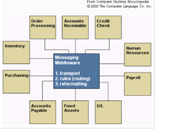

# Middleware
##1.1  Pengertian Middleware
Middleware adalah perangkat lunak komputer yang menyediakan layanan untuk aplikasi perangkat lunak di luar yang tersedia dari sistem operasi. Hal ini dapat digambarkan sebagai "perangkat lunak lem". Middleware memudahkan pengembang perangkat lunak untuk melakukan komunikasi dan input / output, sehingga mereka dapat fokus pada tujuan khusus dari aplikasi mereka. Middleware adalah perangkat lunak yang menghubungkan komponen perangkat lunak atau aplikasi perusahaan. Middleware adalah lapisan perangkat lunak yang terletak di antara sistem operasi dan aplikasi pada setiap sisi jaringan komputer terdistribusi. Biasanya, mendukung kompleks, aplikasi bisnis perangkat lunak yang didistribusikan.
##1.2  Tujuan
Perangkat Middleware memiliki beberapa tujuan, diantaranya adalah :
a.       Menyediakan fasilitas bagi programmer untuk dapat mendistribusikan objek yang digunakan pada beberapa proses yang berbeda.
b.      Dapat berjalan dalam satu mesin ataupun di beberapa mesin yang terhubung dengan jaringan.
jika boleh diperjelas, tujuan dari Middleware ialah sebagai interkoneksi interkoneksi beberapa aplikasi dan masalah interoperabilitas. Middleware sangat dibutuhkan untuk bermigrasi dari aplikasi mainframe ke aplikasi client/server dan juga untuk menyediakan komunikasi antar platform yang berbeda.
##1.3  Manfaat Middleware
Sebuah Abstraksi Middleware diciptakan sebagai perantara antara Sistem Operasi dengan Software Apliskasi yang terdistribusi pastinya memiliki manfaat yang besar :
a.       2 buah platform/aplikasi dapat dijalankan secara bersamaan pada sistem yang terdistribusi
b.      memungkinkan satu aplikasi berkomunikasi dengan lainnya walaupun berjalan pada platform yang berbeda
c.       Transparansi di seluruh jaringan sehingga menyediakan interaksi dengan layanan atau aplikasi lain
d.      Independen dari layanan jaringan
e.       Handal dan selalu tersedia

##1.4 Pembahasan
Middleware sebagai perangkat yang dirancang untuk mendukung Enterprise Arsitektur (EA) sebagai sistem yang tersebar dan saling berhubungan, Ia memiliki beberapa layanan yang bisa digunakan dan dimanfaatkan.
Contoh layanan Middleware :

###Transaction Monitor
1. Produk pertama yang disebut middleware.
2. Menempati posisi antara permintaan dari program client dan database, untuk menyakinkan bahwa semua transaksi ke database terlayani dengan baik

###Messaging Middleware

1. Menyimpan data dalam suatu antrian message jika mesin tujuan sedang mati atau overloaded
2. Berisi business logic yang merutekan message ke ujuan sebenarnya dan memformat ulang data lebih tepat
3. Sama seperti sistem messaging email, kecuali messaging middleware digunakan untuk mengirim data antar aplikasi

###Produk Messaging Middleware
Produk utama messaging (pengiriman pesan) untuk pengaturan komunikasi asinkronus antar aplikasi adalah MQSeries dari IBM. MQSeries telah dipasangkan pada semua platform server. Microsoft memperkenalkan sistem messagingnya sendiri yang digabungkan dengan Component Object Model(COM), yaitu Microsoft Message QueueServer (MSMQ). MSMQ dan MQSeries menawarkan fungsi yang sama.

###Distributed Object Middleware
menurut terminologinya, sebuah Object yang terdistribusikan oleh layanan Middleware, ini merupakan layanan utama yang dimiliki oleh Middleware. layanan ini dibagi menjadi beberapa :
Contoh: RPC (Remote Procedure Calls), CORBA (Common Object Request Broker Architecture) dan DCOM/COM (Distributed Component Object Model)

###Middleware basis data
menyediakan antarmuka antara sebuah query dengan beberapa database yang terdistribusi
Contoh: JDBC, ODBC, dan ADO.NET

###Application Server Middleware
J2EE Application Server, Oracle Application Server
- Lebih detailnya untuk keterangan Middleware sebagai Application Server ialah Sebuah Web-based Application server, yang menyediakan antarmuka untuk berbagai aplikasi,digunakan sebagai middleware antara browser dan aplikasi.
- J2EE adalah contoh application serverA wide range of server-side processing has been supported by appservers(i.e.;J2EE).

##1.5 Lingkungan Komputasi
 
###Pelayanan middleware menyediakan banyak set fungsi dari aplikasi antarmuka pemogramanan yang mengizinkan sebuah aplikasi untuk:
1.    Menemukan tempat melewati jaringan secara transparan sehingga dapat menyediakan interaksi dengan service atau aplikasi lainnya.
2.    Mandiri dari service jaringan.
3.    Dapat dipercaya dan selalu tersedia.

Middleware menawarkan beberapa keuntungan unik dari technologi untuk bisnis dan industri. Sebagai contoh, sistem database tradisional biasanya diletakan dalam lingkungan yang dekat dimana pengguna mengakses sistem menggunakan jaringan terbatas atau intranet. Dengan perkembangan fenomena dari World Wide Web, pengguna dapat mengakses database secara virtual dengan berbagai macam jenis akses dari belahan dunia manapun. Middleware mengalamatkan masalah dari berbagai level interoperbilitas diantara struktur database yang berbeda. Middleware memfasilitasi akses transparan untuk melegalkan sistem manajemen database (DBMS) atau aplikasi lewat sebuah web server tanpa memperhatikan karakteristik spesifik database. 

Perusahaan bisnis sering menggunakan aplikasi middleware untuk menghubungkan informasi dari database departemen, misalnya daftar pembayaran, penjualan, dan penghitungan atau database house dalam lokasi geografi yang bermacam-macam. Dalam tingginya kompetisi komunitas kesehatan, laboratorium membuat luas penggunaan dari aplikasi middleware untuk data mining, sistem informasi laboratorium (LIS) cadangan, dan untuk menggabungkan sistem selama proses penggabungan dua rumah sakit. Middleware menolong menjembatani jarak pemisah antara LIS dalam bentuk baru jaringan kesehatan mengikuti proses pembelian rumah sakit. Pengembang jaringan wireless dapat menggunakan middleware untuk menghadapi tantangan penggabungan dengan sensor jaringan wireless (WSN) atau teknologi WSN. Pengimplementasian sebuah aplikasi middleware mengizinkan pengembang middleware untuk menyatukan sistem operasi dan perangkat keras dengan berbagai macam aplikasi yang tersedia. Middleware dapat menolong pengembang perangkat lunak menghindari penulisan antarmuka program aplikasi (API) untuk setiap pengendali program, dengan cara melayani sebagai sebuah antarmuka pemograman yang berdiri sendiri untuk setiap aplikasi yang dibuat. 

Contoh Middleware:

1. Java's : Remote Procedure Call
2. Object Management Group's : Common Object Request Broker Architecture (CORBA)
3. Microsoft's COM/DCOM (Component Object Model
    - Also .NET Remoting
4. ActiveX controls (in-process COM components).
Database middleware yang paling umum digunakan adalah ODBC (Open DataBase Connectivity). Keterbatasan ODBC adalah bahwa middleware ini didisain untuk bekerja pada tipe penyimpanan relational database. Database middleware yang lain, yang merupakan superset daripada ODBC adalah OLEDB. OLEDB bisa mengakses hampir segala macam bentuk database, kelebihan yang lain dari OLEDB adalah dia didisain dengan konsep obyek komponen (Component Object Model) yang mengandalkan object-oriented computing dan menjadi salah satu trend di dunia komputasi.

Beberapa produk database middleware yang bisa disebutkan di sini adalah Oracle’s DB Integrator (previously DIGITAL’s DB Integrator), Sybase’s Omni CONNECT, and International Software Group’s Navigator. Kelebihan dari produk-produk ini dibandingkan dengan standard seperti ODBC dan OLEDB adalah performance, yang sangat sulit dimiliki oleh suatu produk yang mengacu pada standar.

##1.6 Cara Mendefinisikan Middleware

Ok, sekarang bagaimana sih cara mengggunakananya? Secara default Laravel telah menyediakan tiga buah Middleware dengan nama Authenticate.php, RedirectIfAuthenticated.php dan VerifyCsrfToken.php yang berlokasi di direktori app/Http/Middleware. Untuk dapat menambahkan Middleware baru kita cukup membuat kelas baru dengan format berikut ini:

~~~
<?php

namespace App\Http\Middleware;

use Closure;

class MyMiddleware
{
    public function handle($request, Closure $next)
    {
        //letakkan kode kamu disini...
    }
}
~~~

Seperti yang terlihat pada kode diatas, dalam setiap Middleware terdapat sebuah method khusus yang bernama handle(). Method tersebut memiliki dua buah parameter yaitu Illuminate\Http\Request $request dan Closure $next. Method ini akan dipanggil secara otomatis oleh Laravel ketika kita meregistrasikan middleware tersebut. Lalu, kode seperti apakah yang harus kita letakkan di dalam method handle() tersebut. Berikut ini adalah contoh bagaimana membuat mendefinisikan method handle() yang digunnakan untuk memfilter setiap request agar alamat yang dituju hanya dapat diakses oleh user dengan role admin.

~~~
public function handle($request, Closure $next)
{
    $user = Auth::user();
    if($user->role === User::ROLE_ADMIN) {
        return $next($request);
    }

    return redirect('home');
}
~~~

Contoh kode di atas merupakan kode sederhana yang melakukan pengecekan terhadap role dari user yang sedang login pada saat itu. Apabila user yang sedang login memiliki role admin, maka kita akan meneruskan request yang masuk dan memberikannya kepada Controller yang dituju (dengan memanggil method $next($request)). Namun, apabila user yang melakukan request tidak memiliki role sebagai adminmaka kita akan me-redirect user tersebut ke halaman home. Dengan cara ini kita dapat mem-filter setiap request yang masuk dengan mudah.

###Before/After Middleware

Secara umum, Middleware pada laravel dapat digolongkan kedalam dua kelompok yaitu After Middleware dan Before Middleware. After Middleware merupakan Middleware yang diproses setelah request masuk kedalam Controller, sedangkan Before Middlware merupakan Middleware yang diproses sebelum request masuk kedalam Controller. Berikut ini adalah contoh mendefinisikan kedua buah Middlware tersebut.
~~~
<?php

namespace App\Http\Middleware;

use Closure;

class BeforeMiddleware
{
    public function handle($request, Closure $next)
    {
        //lakukan sesuatu terhadap request yang masuk..

        return $next($request)
    }
}
~~~

Contoh kode di atas merupakan contoh bagaimana mendefinisikan sebuah Before Middleware pada Laravel. Pada kode tersebut terlihat bahwa request yang masuk akan diproses terlebih dahulu sebelum diteruskan ke Controller yang dituju.

~~~
<?php

namespace App\Http\Middleware;

use Closure;

class AfterMiddleware
{
    public function handle($request, Closure $next)
    {
        $response = $next($request);

        //lakukan sesuatu terhadap response yang diperoleh

        return $response
    }
}
~~~
Berbeda dengan ‘Before Middleware’, pada After Middleware kita meneruskan request yang masuk ke Controller yang dituju terlebih dahulu hingga mendapatkan response dari Controller tersebut. Setelah mendapatkan response yang dimaksud, kita akan memprosesnya lebih lanjut sebelum nantinya dikembalikan ke web browser untuk kemudian di render.

###Meregistrasikan Middlware Secara Global

Setiap Middleware yang dibuat dapat diregistrasikan secara global sehingga Middleware terssebut akan selalu dipanggil setiap ada request yang masuk. untuk dapat meregistrasikan Middleware yang dibuat secara global, kita dapat menambahkannya di dalam file app/Http/Kernel.php seperti contoh di bawah ini:

~~~
protected $middleware = [
    \Illuminate\Foundation\Http\Middleware\CheckForMaintenanceMode::class,
    \App\Http\Middleware\EncryptCookies::class,
    \Illuminate\Cookie\Middleware\AddQueuedCookiesToResponse::class,
    \Illuminate\Session\Middleware\StartSession::class,
    \Illuminate\View\Middleware\ShareErrorsFromSession::class,

    \App\Http\Middleware\MyGlobalMiddleware::class, //Middlware yang baru dibuat
];
~~~

###Meregistrasikan Middlware Pada Routes

Selain dapat didefinisikan secara global, komponen Middleware yang dibuat juga dapat diregistrasikan secara spesifik untuk digunakan pada Routes tertentu dengan cara menambahkan nama Middleware yang dibuat kedalam file app/Http/Kernel.php seperti contoh dibawah ini:

~~~
protected $routeMiddleware = [
    'auth' => \App\Http\Middleware\Authenticate::class,
    'auth.basic' => \Illuminate\Auth\Middleware\AuthenticateWithBasicAuth::class,
    'guest' => \App\Http\Middleware\RedirectIfAuthenticated::class,
    'csrf' => \App\Http\Middleware\VerifyCsrfToken::class,
    'oauth' => \LucaDegasperi\OAuth2Server\Middleware\OAuthMiddleware::class,
    'oauth-owner' => \LucaDegasperi\OAuth2Server\Middleware\OAuthOwnerMiddleware::class,
    'my-middlware' => \App\Http\Middleware\MyGlobalMiddleware::class, //Middlware yang baru dibuat
];
~~~

Setelah meregistrasikan Middleware kita kedalam $routeMiddleware seperti contoh diatas, berikutnya adalah memberitahu Laravel Routes mana saja yang akan menggunakan Middleware tersebut dengan cara menambahkan key middlware pada bagian route options yang berada di file app/Http/routes.php seperti contoh dibawah ini:

~~~
Route::get('admin', [
    'uses' => 'AdminController@index',
    'middleware' => 'my-middleware'
]);
~~~

###Meregistrasikan Middleware Pada Controller

Selain dapat diregistrasikan secara global dan disematkan pada Routes, Middleware juga dapat diregistrasikan secara spesifik pada Controller. Dengan meregistrasikan Middleware yang dibuat kedalam Controller, Middleware tersebut akan berlaku untuk setiap method yang ada di dalam Controller tersebut. Lalu, apa bedanya ketika kita mendefinisikan Middleware pada Routes dengan mendefinisikannya pada Controller? Perbedaannya adalah, ketika kita mendefinisikan Middleware pada Controller, kita dapat memberikan opsi kepada Middleware tersebut agar hanya dieksekusi pada method tertentu saja ataupun meng-exclude beberapa method yang tidak ingin disematkan Middleware. Berikut ini adalah contoh bagaimana mendefinisikan Middleware pada Controller:

~~~
class MyController extends Controller
{
    function __construct()
    {
        $this->middleware('my-middleware');
        $this->middleware('log-middleware', ['only' => ['foo', 'bar']]); //selected method
        $this->middleware('subscribe-middleware', ['except' => ['baz']]) ; //exclude method
    }
}  
~~~