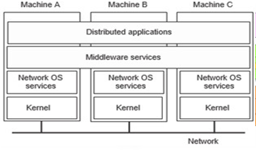

# Middleware
###1.1  Pengertian Middleware
Middleware adalah perangkat lunak komputer yang menyediakan layanan untuk aplikasi perangkat lunak di luar yang tersedia dari sistem operasi. Hal ini dapat digambarkan sebagai "perangkat lunak lem". Middleware memudahkan pengembang perangkat lunak untuk melakukan komunikasi dan input / output, sehingga mereka dapat fokus pada tujuan khusus dari aplikasi mereka. Middleware adalah perangkat lunak yang menghubungkan komponen perangkat lunak atau aplikasi perusahaan. Middleware adalah lapisan perangkat lunak yang terletak di antara sistem operasi dan aplikasi pada setiap sisi jaringan komputer terdistribusi. Biasanya, mendukung kompleks, aplikasi bisnis perangkat lunak yang didistribusikan.
###1.2  Tujuan
Perangkat Middleware memiliki beberapa tujuan, diantaranya adalah :
a.       Menyediakan fasilitas bagi programmer untuk dapat mendistribusikan objek yang digunakan pada beberapa proses yang berbeda.
b.      Dapat berjalan dalam satu mesin ataupun di beberapa mesin yang terhubung dengan jaringan.
jika boleh diperjelas, tujuan dari Middleware ialah sebagai interkoneksi interkoneksi beberapa aplikasi dan masalah interoperabilitas. Middleware sangat dibutuhkan untuk bermigrasi dari aplikasi mainframe ke aplikasi client/server dan juga untuk menyediakan komunikasi antar platform yang berbeda.
###1.3  Manfaat Middleware
Sebuah Abstraksi Middleware diciptakan sebagai perantara antara Sistem Operasi dengan Software Apliskasi yang terdistribusi pastinya memiliki manfaat yang besar :
a.       2 buah platform/aplikasi dapat dijalankan secara bersamaan pada sistem yang terdistribusi
b.      memungkinkan satu aplikasi berkomunikasi dengan lainnya walaupun berjalan pada platform yang berbeda
c.       Transparansi di seluruh jaringan sehingga menyediakan interaksi dengan layanan atau aplikasi lain
d.      Independen dari layanan jaringan
e.       Handal dan selalu tersedia

