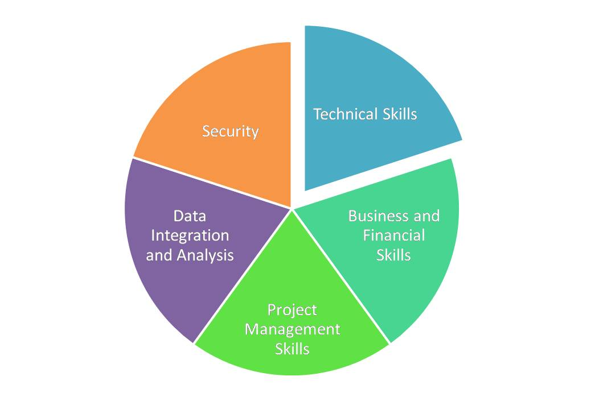

# Memahami Ruang Lingkup Cloud Computing

Cloud computing adalah salah satu yang paling berbicara tentang tren IT saat ini. Hal ini karena fakta bahwa komputasi awan telah membantu beberapa perusahaan untuk menghemat uang sambil menambahkan untuk kenyamanan pengguna. Kata 'Cloud' mengacu pada internet yang meluas, yang berarti Cloud Computing adalah komputasi berbasis internet di mana layanan dikirim ke pengguna melalui internet.
Apa sebenarnya Cloud Computing?

Ini adalah jenis komputasi yang melibatkan berbagi sumber daya komputer daripada menggunakan server lokal atau perangkat khusus untuk pengolahan. Dalam kata-kata sederhana, itu adalah proses menyimpan data yang sering digunakan pada beberapa server yang dapat diakses dengan menggunakan internet. Berbagai layanan seperti server, storage dan aplikasi yang disediakan untuk perangkat komputasi pengguna melalui Internet. Beberapa contoh yang baik dari menggunakan Cloud adalah:

   * Dropbox - Sebuah penyimpanan online menyediakan 2 GB penyimpanan gratis kepada pengguna.

   * Google - Membiarkan pengguna untuk membuat dokumen dan kalender secara gratis.

##Kebutuhan Cloud Computing

Cloud computing kini menjadi standar bisnis. Menyederhanakan aksesibilitas pengguna. Ini menyediakan ruang penyimpanan virtual untuk pengguna yang dapat digunakan tanpa mengganggu tentang rincian seluruh mekanisme. Berikut adalah beberapa alasan lain mengapa setiap perusahaan mungkin perlu komputasi awan untuk bisnis mereka:

   * Penghematan biaya - Cloud computing menghilangkan kebutuhan perusahaan untuk berinvestasi dalam perangkat keras penyimpanan dan server.

   * Berfokus pada bisnis -Sejak semua layanan akan mengeksekusi melalui internet, perusahaan tidak perlu repot masalah teknis dan masalah lain yang terkait dengan penyimpanan fisik dan cadangan. Sebuah perusahaan sehingga dapat lebih fokus pada bisnis inti mereka.

   * Kinerja - Ini memberikan kinerja yang handal terlepas ke lokasi geografis pengguna. Fitur kunci lain bisa menjadi update otomatis dari layanan dan aplikasi.

   * Keamanan - Cloud Computing menawarkan keamanan yang optimal yang melindungi Anda terhadap akses yang tidak sah, modifikasi dan hilangnya data.

   * Fleksibilitas - Bahkan jika bagian dari lingkungan awan gagal atau berhenti bekerja, sumber daya lainnya terus bekerja sampai masalah adalah tetap.

##Dibutuhkan keahlian

Tidak ada kelayakan kualifikasi tertentu untuk belajar Cloud Computing. Calon ini sebaiknya dari IT atau latar belakang terkait komputer sehingga ia / dia memiliki pengetahuan umum tentang komputer dan pemrograman. Pengetahuan tentang dasar-dasar komputasi awan atau pengalaman yang relevan bisa menambahkan besar untuk mendapatkan pekerjaan.

Cloud computing terdiri dari beberapa peran. Ini bisa terkait dengan manajemen, sistem TI, dukungan pengguna akhir, pengembangan aplikasi, analisis bisnis, jaringan, keamanan dan pengembangan web. Setiap peran membutuhkan keterampilan khusus. Berikut adalah kompilasi dari semua keterampilan yang dibutuhkan untuk menjelajahi dunia Cloud Computing.
 
+

Keterampilan teknis - Pengetahuan tentang HTML, PaaS (Platform as a Service), Cloud Computing Dasar-dasar seperti teknologi Virtualisasi (seperti VMWare), OOPS dan bahasa pemrograman seperti Java, C ++, Net dll

Bisnis dan Keterampilan Keuangan - Pengetahuan tentang kasus bisnis, strategi pemasaran online dan terminologi keuangan seperti ROI (Return On Investment).

Manajemen Proyek - Negosiasi dengan klien dan memiliki pengetahuan tentang analisis risiko, perjanjian layanan dan kebijakan.

Integrasi Data dan Analisis - Memiliki pengetahuan database, data mining dan sistem ERP (Enterprise Resource Planning).

Keamanan - Memiliki pengetahuan tentang keamanan internet, enkripsi, otorisasi dan protokol keamanan.
sertifikasi

Berikut adalah beberapa sertifikasi komputasi awan utama:

    * EMC Cloud Arsitek (EMCCA)
    * EMC Cloud Infrastruktur dan Layanan Sertifikasi (Asosiasi Level)
    * EMC virtualisasi Pusat Data dan Sertifikasi Infrastruktur Cloud (Spesialis Level)
    * Sertifikasi VMware Cloud
    * Sertifikat Pengetahuan Cloud Security
    * IBM Certified Solution Architect
    * sertifikasi hp ExpertONE Cloud

Prospek karir

Cloud computing pekerjaan sedang meningkat. Menurut analisis terakhir, pasar komputasi awan internasional diperkirakan akan meningkat menjadi $ 72000000000 pada tahun 2015, dan sekitar 3 lakh kesempatan kerja di India diharapkan pada periode yang sama.

Peran dalam Cloud Computing mungkin berkisar dari pengembang awan ke operator. Setiap peran terdiri dari pengetahuan tentang dasar-dasar komputasi awan dan keterampilan domain tertentu yang spesifik. Berikut adalah beberapa profil pekerjaan populer Cloud terkait:

    Cloud Software Engineer
    Cloud Project Manager
    Cloud Analis Bisnis
    Cloud Jaringan Arsitek / Planner
    Cloud Product Manager
    Cloud Sales Executive
    Cloud Developer / Programmer
    Cloud Konsultan
    Cloud Systems Engineer
    Cloud Sistem Administrator
    Cloud Network Engineer

Permintaan untuk profesional dengan pengetahuan tentang Cloud Computing adalah mengharapkan meningkat secara eksponensial karena semakin banyak perusahaan yang menerapkan teknologi ini. Karena ini, ada sejumlah lembaga yang menyediakan kursus komputasi awan untuk calon calon. Jika Anda adalah salah satu kandidat ini, mendaftarkan diri untuk kelas sekarang.

