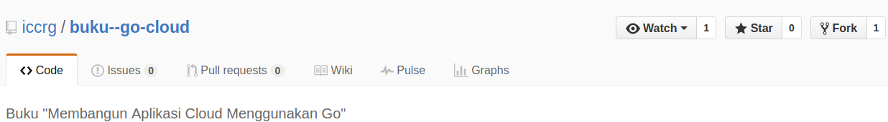
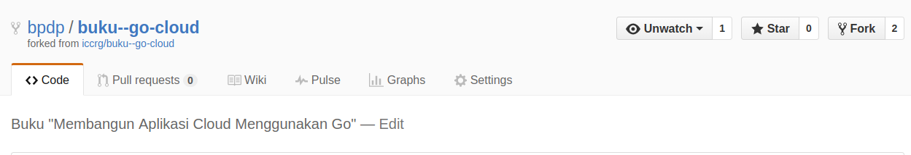
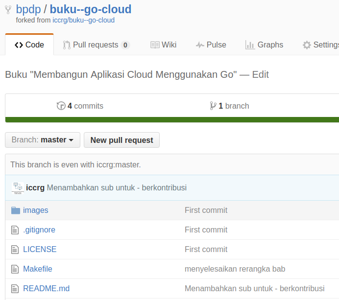
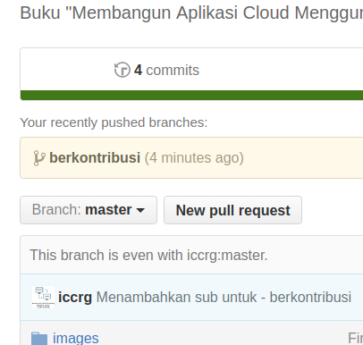
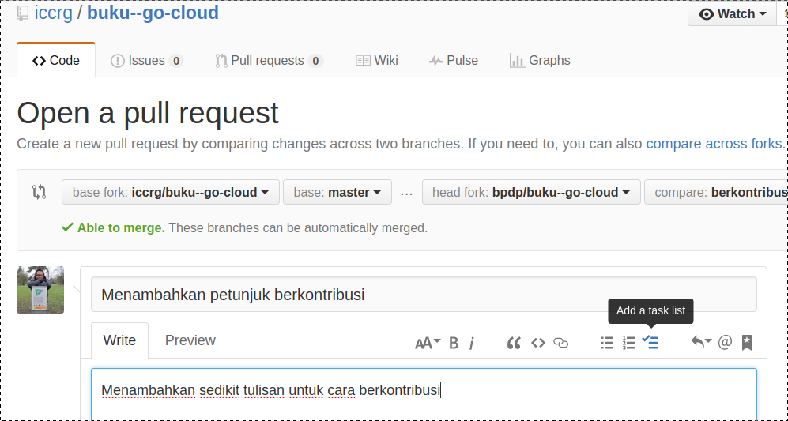
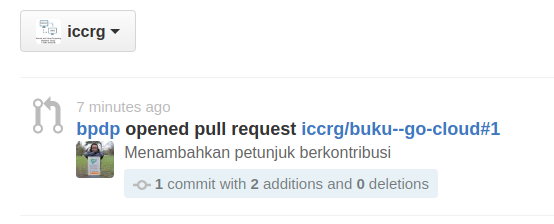
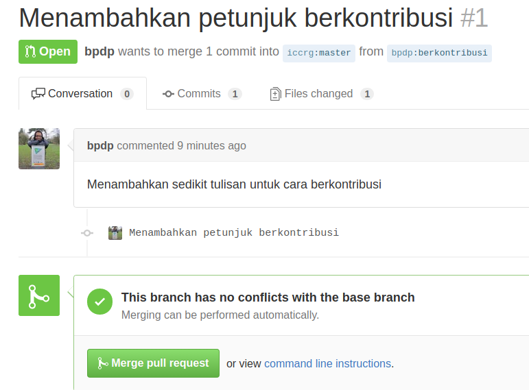
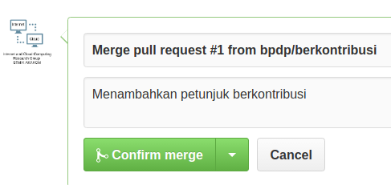
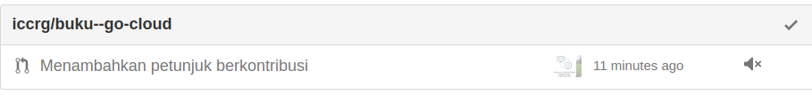
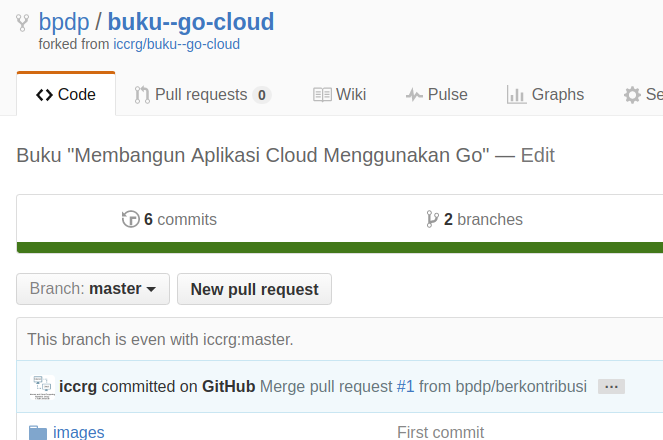

# Berkontribusi

Asumsi untuk pembahasan ini, account yang akan berkontribusi adalah `bpdp`, silahkan ganti sesuai dengan nama account anda.

# Setting awal

Bagian ini harus anda kerjakan sebelum mengirimkan kontribusi. Setting awal ini hanya dilakukan sekali saja.

* Install Git
* Buat account di Github
* Fork repo ini ke repo pada account anda, caranya: login kemudian `fork`.



* Hasil dari fork:



* Pada komputer lokal anda, kerjakan langkah berikut:

```
$ git clone https://github.com/bpdp/buku--go-cloud.git
Cloning into 'buku--go-cloud'...
remote: Counting objects: 59, done.
remote: Compressing objects: 100% (36/36), done.
remote: Total 59 (delta 7), reused 55 (delta 3), pack-reused 0
Unpacking objects: 100% (59/59), done.
Checking connectivity... done.
$
```

Pada kondisi saat ini, di komputer lokal anda sudah terdapat repo `buku--go-cloud` yang berada pada direktori dengan nama yang sama. Untuk keperluan berkontribusi, ada 2 nama repo yang harus anda setting:
  1. origin => menunjuk ke repo milik anda di github, hasil dari fork.
  2. upstream => menunjuk ke repo milik upstream (repo asli) di account ICCRG
Repo `origin` sudah dituliskan konfigurasinya pada saat anda melakukan proses clone dari repo anda. Konfigurasi repo upstream harus dibuat.

```
$ git remote -v
origin  https://github.com/bpdp/buku--go-cloud.git (fetch)
origin  https://github.com/bpdp/buku--go-cloud.git (push)
$
```

Tambahkan remote upstream:

```
$ git remote add upstream https://github.com/iccrg/buku--go-cloud.git
```

Hasil:

```
$ git remote -v
origin  https://github.com/bpdp/buku--go-cloud.git (fetch)
origin  https://github.com/bpdp/buku--go-cloud.git (push)
upstream  https://github.com/iccrg/buku--go-cloud.git (fetch)
upstream  https://github.com/iccrg/buku--go-cloud.git (push)
$
```

* Selesai setting awal.

# Sync Repo Sebelum Pull Request (PR)

Bagian ini dikerjakan sebelum mengirimkan PR. Tujuannya untuk memastikan bahwa yang kita buat belum dibuat oleh orang lain.

```
$ git fetch upstream
remote: Counting objects: 3, done.
remote: Compressing objects: 100% (1/1), done.
remote: Total 3 (delta 2), reused 3 (delta 2), pack-reused 0
Unpacking objects: 100% (3/3), done.
From https://github.com/iccrg/buku--go-cloud
   00e1f40..3085478  master     -> upstream/master
$ git checkout master
$ git merge upstream/master
Updating 00e1f40..3085478
Fast-forward
 README.md | 2 ++
  1 file changed, 2 insertions(+)
$ git status
On branch master
Your branch is ahead of 'origin/master' by 1 commit.
  (use "git push" to publish your local commits)
  nothing to commit, working directory clean
$ git push origin master
Username for 'https://github.com': bpdp
Password for 'https://bpdp@github.com': 
Counting objects: 3, done.
Delta compression using up to 8 threads.
Compressing objects: 100% (3/3), done.
Writing objects: 100% (3/3), 379 bytes | 0 bytes/s, done.
Total 3 (delta 2), reused 0 (delta 0)
To https://github.com/bpdp/buku--go-cloud.git
   00e1f40..3085478  master -> master
$
```

Hasil dari sync tersebut adalah kondisi yang sudah _synchronized_ dengan upstream (disebut dengan _even_).



Sebelum mengirim PR, disarankan untuk melihat log terlebih dahulu untuk memeriksa apakah sudah ada yang melakukan commit terhadap perubahan yang akan anda lakukan.


```
$ git log
commit 3085478da3a8776c46d61cdcb2ba799e26f78aee
Author: Internet and Cloud Computing Research Group STMIK AKAKOM <cloud.stmik.akakom@gmail.com>
Date:   Sun Jun 12 06:14:39 2016 +0700

    Menambahkan sub untuk - berkontribusi

commit 00e1f40947d58049275ca477dbd9cbfb04256d2e
Author: Internet and Cloud Computing Research Group STMIK AKAKOM <cloud.stmik.akakom@gmail.com>
Date:   Wed Jun 8 06:19:26 2016 +0700

    fix typo at README.md - Bab 14

commit 69197fa8c425eb567bee9ff35a85b23b4b795ffe
Author: Internet and Cloud Computing Research Group STMIK AKAKOM <cloud.stmik.akakom@gmail.com>
Date:   Wed Jun 8 06:17:43 2016 +0700

    menyelesaikan rerangka bab

commit ae293364129231378f1912c1d267a1ee2fb0c8af
Author: Internet and Cloud Computing Research Group STMIK AKAKOM <cloud.stmik.akakom@gmail.com>
Date:   Mon Jun 6 13:55:41 2016 +0700

    First commit

$
```

Jika belum ada, maka anda bisa mulai menyiapkan dan mengirimkan perubahan.

# Membuat Perubahan dan Mengirim PR

## Membuat Perubahan

Untuk setiap perubahan, buat dalam branch, jangan buat dalam master karena akan mencampur adukkan dan membuat susah dilacak.

```
$ git checkout -b berkontribusi
$ git branch
* berkontribusi
  master
$
```

Setelah itu editlah seperlunya (bisa meliputi hanya satu file atau lebih banyak lagi), setelah selesai, kirim perubahan tersebut ke repo milik anda (bukan upstream tetapi origin).


```
$ git status
On branch berkontribusi
Changes not staged for commit:
  (use "git add <file>..." to update what will be committed)
  (use "git checkout -- <file>..." to discard changes in working directory)

      modified:   README.md

no changes added to commit (use "git add" and/or "git commit -a")
$ git add -A
$ git commit -m "Menambahkan petunjuk berkontribusi"
[berkontribusi 8f0d331] Menambahkan petunjuk berkontribusi
 1 file changed, 2 insertions(+)
$ git push origin berkontribusi
 Username for 'https://github.com': bpdp
 Password for 'https://bpdp@github.com': 
 Counting objects: 3, done.
 Delta compression using up to 8 threads.
 Compressing objects: 100% (3/3), done.
 Writing objects: 100% (3/3), 420 bytes | 0 bytes/s, done.
 Total 3 (delta 2), reused 0 (delta 0)
 To https://github.com/bpdp/buku--go-cloud.git
  * [new branch]      berkontribusi -> berkontribusi
$
```

Hasil dari proses diatas pada repo anda adalah sebagai berikut:



Pada posisi ini, kontributor siap untuk mengirimkan PR.

## Mengirim PR

* Pada halaman web di repo account Github anda, pilih branch `berkontribusi` kemudian klik pada **New Pull Request**.
* Setelah muncul halaman **Open a pull request**, isikan catatan untuk PR anda tersebut, setelah itu klik pada tombol **Submit pull request**.



* Setelah itu, pada repo ICCRG akan muncul **1 Pull request** sesuai isian anda.


* Pada posisi ini anda tinggal menunggu apakah akan langsung di-merge ataukan ada diskusi lebih dulu.

# Persetujuan Merge

Bagian ini bukan merupakan bagian kontributor tetapi diuraikan disini supaya memahami apa yang harus dilakukan oleh pemilik proyek pada saat terdapat permintaan untuk PR.

* Saat login sebagai pemilik proyek (iccrg), pada halaman repo tersebut akan ditampilkan PR yang dikirimkan oleh bpdp sebagai berikut:



* Pemilik proyek (iccrg) akan melakukan review terhadap PR dengan meng-klik pada PR dan kemudian jika menyetujui akan melakukan proses penggabungan (merge).
* Klik pada tombol `Merge pull request`



* Konfirmasi PR



* Hasil akan ditampilkan dalam tulisan `Merged` dan message pada repo:


* Pemilik proyek melakukan sync dengan repo lokal:

```
$ git pull origin master
```

# Menanti Hasil Merge

Setelah selesai mengirimkan PR, kontributor menunggu proses penggabungan (merge). Jika disetujui, maka pada saat login, akan muncul notifikasi:




Setelah membaca notifikasi itu (jika perlu), kontributor akan tahu bahwa PR yang dia usulkan sudah di-merge. Setelah itu, pada repo lokal kotributor, sync dengan upstream:

```
$ git checkout master
$ git fetch upstream
remote: Counting objects: 1, done.
remote: Total 1 (delta 0), reused 1 (delta 0), pack-reused 0
Unpacking objects: 100% (1/1), done.
From https://github.com/iccrg/buku--go-cloud
  3085478..09e0b94  master     -> upstream/master
$ git merge upstream/master
Updating 8f0d331..09e0b94
Fast-forward
$ git status
On branch master
Your branch is ahead of 'origin/master' by 1 commit.
  (use "git push" to publish your local commits)
  nothing to commit, working directory clean
$ git push origin master
Username for 'https://github.com': bpdp
Password for 'https://bpdp@github.com': 
Counting objects: 1, done.
Writing objects: 100% (1/1), 322 bytes | 0 bytes/s, done.
Total 1 (delta 0), reused 0 (delta 0)
To https://github.com/bpdp/buku--go-cloud.git
  8f0d331..09e0b94  master -> master
$
```

Setelah itu, repo kontributor berada dalam kondisi sync. 


